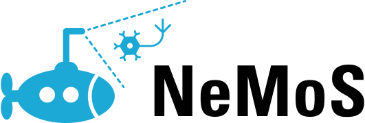
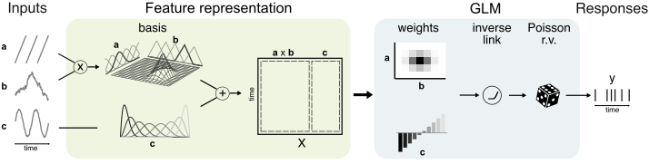
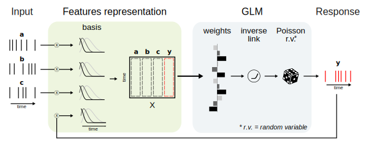

# <div style="text-align: center;">  </div>

[](https://github.com/flatironinstitute/nemos/blob/main/LICENSE)

[](https://www.repostatus.org/#active)

[](https://codecov.io/gh/flatironinstitute/nemos)
[](https://nemos.readthedocs.io/en/latest/?badge=latest)
[](https://github.com/flatironinstitute/nemos/actions/workflows/ci.yml)


NeMoS (Neural ModelS) is a statistical modeling framework optimized for systems neuroscience and powered by [JAX](https://jax.readthedocs.io/en/latest/). 
It streamlines the process of creating and selecting models, through a collection of easy-to-use methods for feature design.

The core of NeMoS includes GPU-accelerated, well-tested implementations of standard statistical models, currently 
focusing on the Generalized Linear Model (GLM). 

We provide a **Poisson GLM** for analyzing spike counts, and a **Gamma GLM** for calcium or voltage imaging traces.

The package is under active development and more methods will be added in the future.

For those looking to get a better grasp of the Generalized Linear Model, we recommend checking out the 
Neuromatch Academy's lesson [here](https://compneuro.neuromatch.io/tutorials/W1D3_GeneralizedLinearModels/student/W1D3_Tutorial1.htmls) and Jonathan Pillow's tutorial 
from Cosyne 2018 [here](https://www.youtube.com/watch?v=NFeGW5ljUoI&t=424s).

## Overview

At his core, NeMoS consists of two primary modules: the `basis` and the `glm` module.

The `basis` module focuses on designing model features (inputs) for the GLM. It includes a suite of composable feature 
constructors that accept time-series data as inputs. These inputs can be any observed variables, such as presented 
stimuli, head direction, position, or spike counts. 

The basis objects can perform two types of transformations on the inputs:

1. **Non-linear Mapping:** This process transforms the input data through a non-linear function, 
   allowing it to capture complex, non-linear relationships between inputs and neuronal firing rates. 
   Importantly, this transformation preserves the properties that makes GLM easy to fit and guarantee a 
   single optimal solution (e.g. convexity).

2. **Convolution:** This applies a convolution of the input data with a bank of filters, designed to 
   capture linear temporal effects. This transformation is particularly useful when analyzing data with 
   inherent time dependencies or when the temporal dynamics of the input are significant.

Both transformations produce a vector of features `X` that changes over time, with a shape 
of `(n_time_points, n_features)`.

On the other hand, the `glm` module maps the feature to spike counts. It is used to learn the GLM weights, 
evaluating the model performance, and explore its behavior on new input.

## Examples

Here's a brief demonstration of how the `basis` and `glm` modules work together within NeMoS.

### Poisson GLM for features analysis



In this example, we'll construct a time-series of features using the basis objects, applying a non-linear mapping
(default behavior):

#### Feature Representation

```python
import nemos as nmo

# Instantiate the basis
basis_1 = nmo.basis.MSplineBasis(n_basis_funcs=5)
basis_2 = nmo.basis.CyclicBSplineBasis(n_basis_funcs=6)
basis_3 = nmo.basis.MSplineBasis(n_basis_funcs=7)

basis = basis_1 * basis_2 + basis_3

# Generate the design matrix starting from some raw 
# input time series, i.e. LFP phase, position, etc.
X = basis.compute_features(input_1, input_2, input_3)
```

#### GLM

```python

# Fit the model mapping X to the spike count
# time-series y
glm = nmo.glm.GLM().fit(X, y)

# Inspect the learned coefficients
print(glm.coef_, glm.intercept_)

# compute the rate
firing_rate = glm.predict(X)

# compute log-likelihood
ll = glm.score(X, y)
```

### Poisson GLM for neural population



This second example demonstrates feature construction by convolving the simultaneously recorded population spike counts with a bank of filters, utilizing the basis in `conv` mode.
The figure above show the GLM scheme for a single neuron, however in NeMoS you can fit jointly the whole population with the [`PopulationGLM`](https://nemos.readthedocs.io/en/latest/generated/how_to_guide/plot_04_population_glm/) object.

#### Feature Representation

```python
import nemos as nmo

# assume that the population spike counts time-series is stored 
# in a 2D array spike_counts of shape (n_samples, n_neurons).

# generate 5 basis functions of 100 time-bins, 
# and convolve the counts with the basis.
X = nmo.basis.RaisedCosineBasisLog(5, mode="conv", window_size=100
    ).compute_features(spike_counts)
```
#### Population GLM

```python
# fit a GLM to the first neuron counts time-series
glm = nmo.glm.PopulationGLM().fit(X, spike_counts)

# compute the rate
firing_rate = glm.predict(X)

# compute log-likelihood
ll = glm.score(X, spike_counts)
```

For a deeper dive, see our [Quickstart](https://nemos.readthedocs.io/en/latest/quickstart/)  guide and consider using [pynapple](https://github.com/pynapple-org/pynapple) for data exploration and preprocessing. When initializing the GLM object, you may optionally specify an [observation
model](https://nemos.readthedocs.io/en/latest/reference/nemos/observation_models/) and a [regularizer](https://nemos.readthedocs.io/en/latest/reference/nemos/regularizer/).

> **Note: Multi-epoch Convolution**
>
> If your data is formatted as a `pynapple` time-series, the convolution performed by the basis objects will be 
> executed epoch-by-epoch, avoiding the risk of introducing artifacts from gaps in your time-series.


## Installation
Run the following `pip` command in your virtual environment.

**For macOS/Linux users:**
 ```bash
 pip install nemos
 ```

**For Windows users:**
 ```
 python -m pip install nemos
 ```

For more details, including specifics for GPU users and developers, refer to NeMoS [docs](https://nemos.readthedocs.io/en/latest/installation/).


## Disclaimer

Please note that this package is currently under development. While you can
download and test the functionalities that are already present, please be aware
that syntax and functionality may change before our preliminary release.

## Getting help and getting in touch

We communicate via several channels on Github:

- To report a bug, open an
  [issue](https://github.com/flatironinstitute/nemos/issues).
- To ask usage questions, discuss broad issues, or show off what you’ve made
  with NeMoS, go to
  [Discussions](https://github.com/flatironinstitute/nemos/discussions).
- To send suggestions for extensions or enhancements, please post in the
  [ideas](https://github.com/flatironinstitute/nemos/discussions/categories/ideas)
  section of discussions first. We’ll discuss it there and, if we decide to
  pursue it, open an issue to track progress.
- To contribute to the project, see the [contributing
  guide](CONTRIBUTING.md).

In all cases, we request that you respect our [code of
conduct](CODE_OF_CONDUCT.md).

## Support

This package is supported by the Center for Computational Neuroscience, in the Flatiron Institute of the Simons Foundation.  

 
