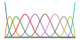
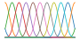
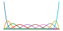
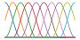
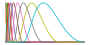

# Basis Function

```{table}
:name: table-basis

|           **Basis**               |                                     **Kernel Visualization**                 |                       **Examples**                       |                           **Evaluation/Convolution**                                                                                     | **Preferred Mode**   |                               
|:---------------------------------:|:----------------------------------------------------------------------------:|:--------------------------------------------------------:|:----------------------------------------------------------------------------------------------------------------------------------------:|:--------------------:|
|            **B-Spline**           |                          | [Grid cells](grid_cells_nemos)                           | [EvalBSpline](nemos.basis.basis.EvalBSpline)<br>[ConvBSpline](nemos.basis.basis.ConvBSpline)                                             | 🟢 Eval              |
|      **Cyclic B-Spline**          |             | [Place cells](basis_eval_place_cells)                    | [EvalCyclicBSpline](nemos.basis.basis.EvalCyclicBSpline)<br>[ConvCyclicBSpline](nemos.basis.basis.ConvCyclicBSpline)                     | 🟢 Eval              |
|           **M-Spline**            |                          | [Place cells](basis_eval_place_cells)                    | [EvalMSpline](nemos.basis.basis.EvalMSpline)<br>[ConvMSpline](nemos.basis.basis.ConvMSpline)                                             | 🟢 Eval              |
| **Linearly Spaced Raised Cosine** |   |                                                          | [EvalRaisedCosineLinear](nemos.basis.basis.EvalRaisedCosineLinear)<br>[ConvRaisedCosineLinear](nemos.basis.basis.ConvRaisedCosineLinear) | 🟢 Eval              |
|    **Log Spaced Raised Cosine**   |         | [Head Direction](head_direction_reducing_dimensionality) | [EvalRaisedCosineLog](nemos.basis.basis.EvalRaisedCosineLog)<br>[ConvRaisedCosineLog](nemos.basis.basis.ConvRaisedCosineLog)             | 🔵 Conv              |
```

## Overview

A basis function is a collection of simple building blocks—functions that, when combined (weighted and summed together), can represent more complex, non-linear relationships. Think of them as tools for constructing predictors in GLMs, helping to model:

1. **Non-linear mappings** between task variables (like velocity or position) and firing rates.
2. **Linear temporal effects**, such as spike history, neuron-to-neuron couplings, or how stimuli are integrated over time.

In a GLM, we assume a non-linear mapping exists between task variables and neuronal firing rates. This mapping isn’t something we can directly observe—what we do see are the inputs (task covariates) and the resulting neural activity. The challenge is to infer a "good" approximation of this hidden relationship.

Basis functions help simplify this process by representing the non-linearity as a weighted sum of fixed functions, $\psi_1(x), \dots, \psi_n(x)$, with weights $\alpha_1, \dots, \alpha_n$. Mathematically:

$$
f(x) \approx \alpha_1 \psi_1(x) + \dots + \alpha_n \psi_n(x)
$$

Here, $\approx$ means "approximately equal". Instead of tackling the hard problem of learning an unknown function $f(x)$ directly, we reduce it to the simpler task of learning the weights $\{\alpha_i\}$.


## Basis in NeMoS

NeMoS provides a variety of basis function objects, each tailored for specific shapes and use cases. These objects make it easy to define both non-linear features and temporal predictors. Depending on the type of modeling you need, NeMoS offers:

- **Eval-basis objects**: For creating non-linear features. (Names start with `Eval`.)
- **Conv-basis objects**: For defining temporal predictors. (Names start with `Conv`.)

If you want to know how to create and use one-dimensional bases or combining them to build multi-dimensional predictors, check out these resources:

::::{grid} 1 2 2 2

:::{grid-item-card}

<figure>

</figure>

```{toctree}
:maxdepth: 2

plot_01_1D_basis_function.md
```
:::

:::{grid-item-card}

<figure>

</figure>

```{toctree}
:maxdepth: 2

plot_02_ND_basis_function.md
```
:::

::::