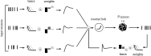

# nemos 

[](https://github.com/flatironinstitute/nemos/blob/main/LICENSE)

[](https://www.repostatus.org/#wip)
[](https://codecov.io/gh/flatironinstitute/nemos)
[](https://nemos.readthedocs.io/en/latest/?badge=latest)
[](https://github.com/flatironinstitute/nemos/actions/workflows/ci.yml)

`nemos` (NEural MOdelS) is a statistical modeling framework optimized for systems neuroscience and powered by [JAX](jax.readthedocs.io/). 
It streamlines the process of creating and selecting models, through a collection of easy-to-use methods for feature design.

The core of `nemos` includes GPU-accelerated, well-tested implementations of standard statistical models, currently 
focusing on the Generalized Linear Model (GLM). 

The package is under active development and more methods will be added in the future.

For those looking to get a better grasp of the Generalized Linear Model, we recommend checking out the 
Neuromatch Academy's lesson [here](https://www.youtube.com/watch?v=NFeGW5ljUoI&t=424s) and Jonathan Pillow's tutorial 
from Cosyne 2018 [here](https://www.youtube.com/watch?v=NFeGW5ljUoI&t=424s).


## Installation
Run the following `pip` command in your virtual environment.

**For macOS/Linux users:**
 ```bash
 pip install git+https://github.com/flatironinstitute/nemos.git
 ```

**For Windows users:**
 ```
 python -m pip install git+https://github.com/flatironinstitute/nemos.git
 ```

For more details, including specifics for GPU users and developers, refer to `nemos` [docs](https://nemos.readthedocs.io/en/latest/installation/).


## Basic usage

`nemos` streamlines the design of a GLM model. To illustrate how, let's see how we can model
a neuron that is driven by the activity of all the simultaneously recorded units. 

The model we want to set up is illustrated below,

<br><br>
<figure markdown>

<figcaption>Coupled GLM model.</figcaption>
</figure>

Specifically, this model requires

1. Convolve the spike counts of each neuron with a bank of filters, called "basis function".
2. Weight the convolution outputs and sum them together.
3. Pass the result through a positive non-linearity to get the firing rate.
4. Compute the Poisson likelihood of the observed count.

This is schematized below,


With nemos you can define such a model with a few lines of code.

```python
import nemos as nmo

counts  = ...  # 2D array or TsdFrame, shape (num samples, num neurons).

# generate 10 basis functions of 100 time-bin
_, basis = nmo.basis.RaisedCosineBasisLog(10).evaluate_on_grid(100)

# convolve the counts with the all the basis, output shape (num samples, num neurons, num basis).
conv_counts = nmo.convolve.create_convolutional_predictor(basis, counts)

# fit a GLM to the first neuron spike counts
glm = nmo.glm.GLM().fit(conv_counts, counts[:, 0])

# compute the rate
firing_rate = glm.predict(conv_counts)

# compute log-likelihood
ll = glm.score(conv_counts)
```
We recommend using [pynapple](https://github.com/pynapple-org/pynapple) for initial exploration and reshaping of your data!


When initializing the `GLM` object, users can optionally specify the
[observation
model](https://nemos.readthedocs.io/en/latest/reference/nemos/observation_models/)
(also known as the noise model) and the
[regularizer](https://nemos.readthedocs.io/en/latest/reference/nemos/regularizer/).

See [Quickstart](https://nemos.readthedocs.io/en/latest/quickstart/) for a
slightly longer overview of basic nemos functionality.

## Disclaimer

Please note that this package is currently under development. While you can
download and test the functionalities that are already present, please be aware
that syntax and functionality may change before our preliminary release.

## Getting help and getting in touch

We communicate via several channels on Github:

- To report a bug, open an
  [issue](https://github.com/flatironinstitute/nemos/issues).
- To ask usage questions, discuss broad issues, or show off what you’ve made
  with nemos, go to
  [Discussions](https://github.com/flatironinstitute/nemos/discussions).
- To send suggestions for extensions or enhancements, please post in the
  [ideas](https://github.com/flatironinstitute/nemos/discussions/categories/ideas)
  section of discussions first. We’ll discuss it there and, if we decide to
  pursue it, open an issue to track progress.
- To contribute to the project, see the [contributing
  guide](CONTRIBUTING.md).

In all cases, we request that you respect our [code of
conduct](CODE_OF_CONDUCT.md).

