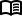
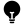
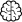
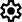
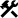

# <div style="text-align: center;">  </div>

[](https://github.com/flatironinstitute/nemos/blob/main/LICENSE)

[](https://www.repostatus.org/#active)

[](https://codecov.io/gh/flatironinstitute/nemos)
[](https://nemos.readthedocs.io/en/latest/?badge=latest)
[](https://github.com/flatironinstitute/nemos/actions/workflows/ci.yml)

## Overview

NeMoS (Neural ModelS) is a statistical modeling framework optimized for systems neuroscience and powered by [JAX](https://jax.readthedocs.io/en/latest/). 
It streamlines the process of defining and selecting models, through a collection of easy-to-use methods for feature design.

The core of NeMoS includes GPU-accelerated, well-tested implementations of standard statistical models, currently 
focusing on the Generalized Linear Model (GLM). 

We provide a **Poisson GLM** for analyzing spike counts, and a **Gamma GLM** for calcium or voltage imaging traces.

<div class="grid cards" markdown>

-   :material-clock-fast:{ .lg .middle } __Getting Started__

      ---

      New to NeMoS? Get the ball rolling with our quickstart.

      [:octicons-arrow-right-24: Quickstart](quickstart.md)

-    __Background__

    ---

    Refresh your theoretical knowledge before diving into data analysis with our notes.

    [:octicons-arrow-right-24: Background](generated/background)

-    __How-To Guide__

    ---

    Already familiar with the concepts? Learn how you to process and analyze your data with NeMoS.

    *Requires familiarity with the theory.*<br>
    [:octicons-arrow-right-24: How-To Guide](generated/how_to_guide)

-     __Neural Modeling__

    ---

    Explore fully worked examples to learn how to analyze neural recordings from scratch.

    *Requires familiarity with the theory.*<br>
    [:octicons-arrow-right-24: Tutorials](generated/tutorials)

-    __API Guide__

    ---

    Access a detailed description of each module and function, including parameters and functionality. 

    *Requires familiarity with the theory.*<br>
    [:octicons-arrow-right-24: API Guide](generated/api_guide)

-    __Installation Instructions__ 

    ---
    
    Run the following `pip` command in your virtual environment.
    === "macOS/Linux"

        ```bash
        pip install nemos
        ```

    === "Windows"
    
        ```
        python -m pip install nemos
        ```
    
    *For more information see:*<br>
    [:octicons-arrow-right-24: Install](installation.md)

</div>

!!! warning "Disclaimer"
    Please note that this package is currently under development. While you can
    download and test the functionalities that are already present, please be aware
    that syntax and functionality may change before our preliminary release.
    
    For those looking to get a better grasp of the Generalized Linear Model, we recommend checking out the 
    Neuromatch Academy's lesson [here](https://compneuro.neuromatch.io/tutorials/W1D3_GeneralizedLinearModels/student/W1D3_Tutorial1.html) and Jonathan Pillow's tutorial 
    from Cosyne 2018 [here](https://www.youtube.com/watch?v=NFeGW5ljUoI&t=424s).


## Getting help and getting in touch

We communicate via several channels on Github:

- To report a bug, open an
  [issue](https://github.com/flatironinstitute/nemos/issues).
- To ask usage questions, discuss broad issues, or show off what you’ve made
  with NeMoS, go to
  [Discussions](https://github.com/flatironinstitute/nemos/discussions).
- To send suggestions for extensions or enhancements, please post in the
  [ideas](https://github.com/flatironinstitute/nemos/discussions/categories/ideas)
  section of discussions first. We’ll discuss it there and, if we decide to
  pursue it, open an issue to track progress.
- To contribute to the project, see the [contributing
  guide](https://github.com/flatironinstitute/nemos/blob/main/CONTRIBUTING.md).

In all cases, we request that you respect our [code of
conduct](https://github.com/flatironinstitute/nemos?tab=coc-ov-file).

