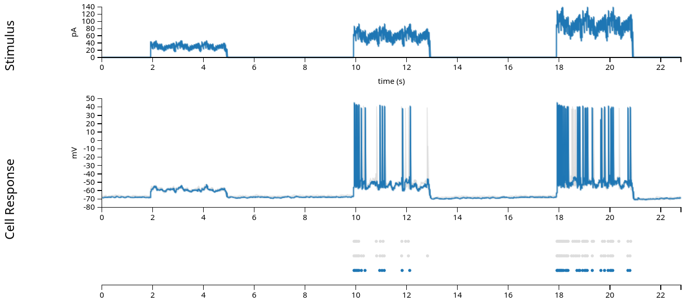

---
jupytext:
  text_representation:
    extension: .md
    format_name: myst
    format_version: 0.13
    jupytext_version: 1.16.4
kernelspec:
  display_name: Python 3 (ipykernel)
  language: python
  name: python3
---

```{code-cell} ipython3
:tags: [hide-input]

%matplotlib inline
import warnings

# Ignore the first specific warning
warnings.filterwarnings(
    "ignore",
    message="plotting functions contained within `_documentation_utils` are intended for nemos's documentation.",
    category=UserWarning,
)

# Ignore the second specific warning
warnings.filterwarnings(
    "ignore",
    message="Ignoring cached namespace 'core'",
    category=UserWarning,
)

warnings.filterwarnings(
    "ignore",
    message=(
        "invalid value encountered in div "
    ),
    category=RuntimeWarning,
)
```

# Fit injected current

For our first example, we will look at a very simple dataset: patch-clamp
recordings from a single neuron in layer 4 of mouse primary visual cortex. This
data is from the [Allen Brain
Atlas](https://celltypes.brain-map.org/experiment/electrophysiology/478498617),
and experimenters injected current directly into the cell, while recording the
neuron's membrane potential and spiking behavior. The experiments varied the
shape of the current across many sweeps, mapping the neuron's behavior in
response to a wide range of potential inputs.

For our purposes, we will examine only one of these sweeps, "Noise 1", in which
the experimentalists injected three pulses of current. The current is a square
pulse multiplied by a sinusoid of a fixed frequency, with some random noise
riding on top.



In the figure above (from the Allen Brain Atlas website), we see the
approximately 22 second sweep, with the input current plotted in the first row,
the intracellular voltage in the second, and the recorded spikes in the third.
(The grey lines and dots in the second and third rows comes from other sweeps
with the same stimulus, which we'll ignore in this exercise.) When fitting the
Generalized Linear Model, we are attempting to model the spiking behavior, and
we generally do not have access to the intracellular voltage, so for the rest
of this notebook, we'll use only the input current and the recorded spikes
displayed in the first and third rows.

First, let us see how to load in the data and reproduce the above figure, which
we'll do using the [Pynapple package](https://pynapple-org.github.io/pynapple/). We will rely on 
pynapple throughout this notebook, as it simplifies handling this type of
data (we will explain the essentials of pynapple as they are used, but see the 
[Pynapple docs](https://pynapple-org.github.io/pynapple/)
if you are interested in learning more). After we've explored the data some, we'll introduce the Generalized
Linear Model and how to fit it with NeMoS.

## Learning objectives 

- Learn how to explore spiking data and do basic analyses using pynapple
- Learn how to structure data for NeMoS
- Learn how to fit a basic Generalized Linear Model using NeMoS
- Learn how to retrieve the parameters and predictions from a fit GLM for
  intrepetation.

```{code-cell} ipython3
# Import everything
import jax
import matplotlib.pyplot as plt
import numpy as np
import pynapple as nap

import nemos as nmo

# some helper plotting functions
from nemos import _documentation_utils as doc_plots

# configure plots some
plt.style.use(nmo.styles.plot_style)
```

## Data Streaming

While you can download the data directly from the Allen Brain Atlas and
interact with it using their
[AllenSDK](https://allensdk.readthedocs.io/en/latest/visual_behavior_neuropixels.html),
we prefer the burgeoning [Neurodata Without Borders (NWB)
standard](https://nwb-overview.readthedocs.io/en/latest/). We have converted
this single dataset to NWB and uploaded it to the [Open Science
Framework](https://osf.io/5crqj/). This allows us to easily load the data
using pynapple, and it will immediately be in a format that pynapple understands!

:::{tip}

  Pynapple can stream any NWB-formatted dataset! See [their
  documentation](https://pynapple.org/examples/tutorial_pynapple_dandi.html)
  for more details, and see the [DANDI Archive](https://dandiarchive.org/)
  for a repository of compliant datasets.
:::

The first time the following cell is run, it will take a little bit of time
to download the data, and a progress bar will show the download's progress.
On subsequent runs, the cell gets skipped: we do not need to redownload the
data.

```{code-cell} ipython3
path = nmo.fetch.fetch_data("allen_478498617.nwb")
```

## Pynapple

### Data structures and preparation

Now that we've downloaded the data, let's open it with pynapple and examine
its contents.

```{code-cell} ipython3
data = nap.load_file(path)
print(data)
```

The dataset contains several different pynapple objects, which we will
explore throughout this demo. The following illustrates how these fields relate to the data
we visualized above:


<!-- this gif created with the following imagemagick command: convert -layers OptimizePlus -delay 100 allen_data_annotated-units.svg allen_data_annotated-epochs.svg allen_data_annotated-stimulus.svg allen_data_annotated-response.svg -loop 0 allen_data_annotated.gif -->

- `units`: dictionary of neurons, holding each neuron's spike timestamps.
- `epochs`: start and end times of different intervals, defining the
  experimental structure, specifying when each stimulation protocol began and
  ended.
- `stimulus`: injected current, in Amperes, sampled at 20k Hz.
- `response`: the neuron's intracellular voltage, sampled at 20k Hz.
  We will not use this info in this example

Now let's go through the relevant variables in some more detail:

```{code-cell} ipython3
trial_interval_set = data["epochs"]

current = data["stimulus"]
spikes = data["units"]
```

First, let's examine `trial_interval_set`:

```{code-cell} ipython3
trial_interval_set
```

`trial_interval_set` is an
[`IntervalSet`](https://pynapple.org/generated/pynapple.IntervalSet.html),
with a metadata columns (`tags`) defining the stimulus protocol.

```{code-cell} ipython3
noise_interval = trial_interval_set[trial_interval_set.tags == "Noise 1"]
noise_interval
```

As described above, we will be examining "Noise 1". We can see it contains
three rows, each defining a separate sweep. We'll just grab the first sweep
(shown in blue in the pictures above) and ignore the other two (shown in
gray).

```{code-cell} ipython3
noise_interval = noise_interval[0]
noise_interval
```

Now let's examine `current`:

```{code-cell} ipython3
current
```

`current` is a `Tsd`
([TimeSeriesData](https://pynapple.org/generated/pynapple.Tsd.html))
object with 2 columns. Like all `Tsd` objects, the first column contains the
time index and the second column contains the data; in this case, the current
in Ampere (A).

Currently, `current` contains the entire ~900 second experiment but, as
discussed above, we only want one of the "Noise 1" sweeps. Fortunately,
`pynapple` makes it easy to grab out the relevant time points by making use
of the `noise_interval` we defined above:

```{code-cell} ipython3
current = current.restrict(noise_interval)
# convert current from Ampere to pico-amperes, to match the above visualization
# and move the values to a more reasonable range.
current = current * 1e12
current
```

Notice that the timestamps have changed and our shape is much smaller.

Finally, let's examine the spike times. `spikes` is a
[`TsGroup`](https://pynapple.org/generated/pynapple.TsGroup.html),
a dictionary-like object that holds multiple `Ts` (timeseries) objects with
potentially different time indices:

```{code-cell} ipython3
spikes
```

Typically, this is used to hold onto the spike times for a population of
neurons. In this experiment, we only have recordings from a single neuron, so
there's only one row.

We can index into the `TsGroup` to see the timestamps for this neuron's
spikes:

```{code-cell} ipython3
spikes[0]
```

Similar to `current`, this object originally contains data from the entire
experiment. To get only the data we need, we again use
`restrict(noise_interval)`:

```{code-cell} ipython3
spikes = spikes.restrict(noise_interval)
print(spikes)
spikes[0]
```

Now, let's visualize the data from this trial, replicating rows 1 and 3
from the Allen Brain Atlas figure at the beginning of this notebook:

```{code-cell} ipython3
fig, ax = plt.subplots(1, 1, figsize=(8, 2))
ax.plot(current, "grey")
ax.plot(spikes.to_tsd([-5]), "|", color="k", ms = 10)
ax.set_ylabel("Current (pA)")
ax.set_xlabel("Time (s)")
```

### Basic analyses

Before using the Generalized Linear Model, or any model, it's worth taking
some time to examine our data and think about what features are interesting
and worth capturing. As we discussed in the [background](../../background/plot_00_conceptual_intro),
the GLM is a model of the neuronal firing rate. However, in our experiments,
we do not observe the firing rate, only the spikes! Moreover, neural
responses are typically noisy&mdash;even in this highly controlled experiment
where the same current was injected over multiple trials, the spike times
were slightly different from trial-to-trial. No model can perfectly predict
spike times on an individual trial, so how do we tell if our model is doing a
good job?

Our objective function is the log-likelihood of the observed spikes given the
predicted firing rate. That is, we're trying to find the firing rate, as a
function of time, for which the observed spikes are likely. Intuitively, this
makes sense: the firing rate should be high where there are many spikes, and
vice versa. However, it can be difficult to figure out if your model is doing
a good job by squinting at the observed spikes and the predicted firing rates
plotted together.

One common way to visualize a rough estimate of firing rate is to smooth
the spikes by convolving them with a Gaussian filter.

:::{note}

This is a heuristic for getting the firing rate, and shouldn't be taken
as the literal truth (to see why, pass a firing rate through a Poisson
process to generate spikes and then smooth the output to approximate the
generating firing rate). A model should not be expected to match this
approximate firing rate exactly, but visualizing the two firing rates
together can help you reason about which phenomena in your data the model
is able to adequately capture, and which it is missing.

For more information, see section 1.2 of [*Theoretical
Neuroscience*](https://boulderschool.yale.edu/sites/default/files/files/DayanAbbott.pdf),
by Dayan and Abbott.
:::

Pynapple can easily compute this approximate firing rate, and plotting this
information will help us pull out some phenomena that we think are
interesting and would like a model to capture.

First, we must convert from our spike times to binned spikes:

```{code-cell} ipython3
# bin size in seconds
bin_size = 0.001
# Get spikes for neuron 0
count = spikes[0].count(bin_size)
count
```

Now, let's convert the binned spikes into the firing rate, by smoothing them
with a gaussian kernel. Pynapple again provides a convenience function for
this:

```{code-cell} ipython3
# the inputs to this function are the standard deviation of the gaussian in seconds and
# the full width of the window, in standard deviations. So std=.05 and size_factor=20
# gives a total filter size of 0.05 sec * 20 = 1 sec.
firing_rate = count.smooth(std=0.05, size_factor=20)
# convert from spikes per bin to spikes per second (Hz)
firing_rate = firing_rate / bin_size
```

Note that firing_rate is a [`TsdFrame`](https://pynapple.org/generated/pynapple.TsdFrame.html)!

```{code-cell} ipython3
print(type(firing_rate))
```

Now that we've done all this preparation, let's make a plot to more easily
visualize the data.

:::{note}

We're hiding the details of the plotting function for the purposes of this tutorial, but you can find it in [the source
code](https://github.com/flatironinstitute/nemos/blob/development/src/nemos/_documentation_utils/plotting.py)
if you are interested.
:::

```{code-cell} ipython3
doc_plots.current_injection_plot(current, spikes, firing_rate);
```

So now that we can view the details of our experiment a little more clearly,
what do we see?

- We have three intervals of increasing current, and the firing rate
  increases as the current does.

- While the neuron is receiving the input, it does not fire continuously or
  at a steady rate; there appears to be some periodicity in the response. The
  neuron fires for a while, stops, and then starts again. There's periodicity
  in the input as well, so this pattern in the response might be reflecting
  that.

- There's some decay in firing rate as the input remains on: there are three
  four "bumps" of neuronal firing in the second and third intervals and they
  decrease in amplitude, with first being the largest.

These give us some good phenomena to try and predict! But there's something
that's not quite obvious from the above plot: what is the relationship
between the input and the firing rate? As described in the first bullet point
above, it looks to be *monotonically increasing*: as the current increases,
so does the firing rate. But is that exactly true? What form is that
relationship?

Pynapple can compute a tuning curve to help us answer this question, by
binning our spikes based on the instantaneous input current and computing the
firing rate within those bins:

:::{admonition} Tuning curve in `pynapple`
:class: note 

[`compute_1d_tuning_curves`](https://pynapple.org/generated/pynapple.process.tuning_curves.html#pynapple.process.tuning_curves.compute_1d_tuning_curves) : compute the firing rate as a function of a 1-dimensional feature.
:::

```{code-cell} ipython3
tuning_curve = nap.compute_1d_tuning_curves(spikes, current, nb_bins=15)
tuning_curve
```

`tuning_curve` is a pandas DataFrame where each column is a neuron (one
neuron in this case) and each row is a bin over the feature (here, the input
current). We can easily plot the tuning curve of the neuron:

```{code-cell} ipython3
doc_plots.tuning_curve_plot(tuning_curve);
```

We can see that, while the firing rate mostly increases with the current,
it's definitely not a linear relationship, and it might start decreasing as
the current gets too large.

So this gives us three interesting phenomena we'd like our model to help
explain: the tuning curve between the firing rate and the current, the firing
rate's periodicity, and the gradual reduction in firing rate while the
current remains on.


## NeMoS 

### Preparing data

Now that we understand our model, we're almost ready to put it together.
Before we construct it, however, we need to get the data into the right
format.

NeMoS requires that the predictors and spike counts it operates on have the
following properties:

- predictors and spike counts must have the same number of time points.

- predictors must be two-dimensional, with shape `(n_time_bins, n_features)`.
  In this example, we have a single feature (the injected current).

- spike counts must be one-dimensional, with shape `(n_time_bins, )`. As
  discussed above, `n_time_bins` must be the same for both the predictors and
  spike counts.

- predictors and spike counts must be
  [`jax.numpy`](https://jax.readthedocs.io/en/latest/jax-101/01-jax-basics.html)
  arrays, `numpy` arrays or `pynapple` `TsdFrame`/`Tsd`.

:::{admonition} What is jax?
:class: note

[jax](https://github.com/jax-ml/jax) is a Google-supported python library
for automatic differentiation. It has all sorts of neat features, but the
most relevant of which for NeMoS is its GPU-compatibility and
just-in-time compilation (both of which make code faster with little
overhead!), as well as the collection of optimizers present in
[jaxopt](https://jaxopt.github.io/stable/).
:::

First, we require that our predictors and our spike counts have the same
number of time bins. We can achieve this by down-sampling our current to the
spike counts to the proper resolution using the
[`bin_average`](https://pynapple.org/generated/pynapple.Tsd.bin_average.html)
method from pynapple:

```{code-cell} ipython3
binned_current = current.bin_average(bin_size)

print(f"current shape: {binned_current.shape}")
# rate is in Hz, convert to KHz
print(f"current sampling rate: {binned_current.rate/1000.:.02f} KHz")

print(f"\ncount shape: {count.shape}")
print(f"count sampling rate: {count.rate/1000:.02f} KHz")
```

Secondly, we have to reshape our variables so that they are the proper shape:

- `predictors`: `(n_time_bins, n_features)`
- `count`: `(n_time_bins, )`

Because we only have a single predictor feature, we'll use
[`np.expand_dims`](https://numpy.org/doc/stable/reference/generated/numpy.expand_dims.html)
to ensure it is a 2d array.

```{code-cell} ipython3
predictor = np.expand_dims(binned_current, 1)

# check that the dimensionality matches NeMoS expectation
print(f"predictor shape: {predictor.shape}")
print(f"count shape: {count.shape}")
```

:::{admonition} What if I have more than one neuron?
:class: info

In this example, we're only fitting data for a single neuron, but you
might wonder how the data should be shaped if you have more than one
neuron -- do you add an extra dimension? or concatenate neurons along one
of the existing dimensions?

In NeMoS, we always fit Generalized Linear Models to a single neuron at a
time. We'll discuss this more in the [following
tutorial](plot_02_head_direction.md), but briefly: you get the same answer
whether you fit the neurons separately or simultaneously, and fitting
them separately can make your life easier.
:::

### Fitting the model

Now we're ready to fit our model!

First, we need to define our GLM model object. We intend for users
to interact with our models like
[scikit-learn](https://scikit-learn.org/stable/getting_started.html)
estimators. In a nutshell, a model instance is initialized with
hyperparameters that specify optimization and model details,
and then the user calls the `.fit()` function to fit the model to data.
We will walk you through the process below by example, but if you
are interested in reading more details see the [Getting Started with scikit-learn](https://scikit-learn.org/stable/getting_started.html) webpage.

To initialize our model, we need to specify the regularizer and observation
model objects, both of which should be one of our custom objects:

- Regularizer: this object specifies both the solver algorithm and the
  regularization scheme. They are jointly specified because each
  regularization scheme has a list of compatible solvers to choose between.
  Regularization modifies the objective function to reflect your prior
  beliefs about the parameters, such as sparsity. Regularization becomes more
  important as the number of input features, and thus model parameters,
  grows. They can be found within [`nemos.regularizer`](regularizers).

:::{warning}

With a convex problem like the GLM, in theory it does not matter which
solver algorithm you use. In practice, due to numerical issues, it
generally does. Thus, it's worth trying a couple to see how their
solutions compare. (Different regularization schemes will always give
different results.)
:::

- Observation model: this object links the firing rate and the observed
  data (in this case spikes), describing the distribution of neural activity (and thus changing
  the log-likelihood). For spiking data, we use the Poisson observation model, but
  we discuss other options for continuous data
  in [the calcium imaging analysis demo](plot_06_calcium_imaging.md).

For this example, we'll use an un-regularized LBFGS solver. We'll discuss
regularization in a later tutorial.

:::{admonition} Why LBFGS?
:class: info

[LBFGS](https://en.wikipedia.org/wiki/Limited-memory_BFGS) is a
quasi-Netwon method, that is, it uses the first derivative (the gradient)
and approximates the second derivative (the Hessian) in order to solve
the problem. This means that LBFGS tends to find a solution faster and is
often less sensitive to step-size. Try other solvers to see how they
behave!
:::

```{code-cell} ipython3
# Initialize the model w/regularizer and solver
model = nmo.glm.GLM(solver_name="LBFGS")
```

Now that we've initialized our model with the optimization parameters, we can
fit our data! In the previous section, we prepared our model matrix
(`predictor`) and target data (`count`), so to fit the model we just need to
pass them to the model:

```{code-cell} ipython3
model.fit(predictor, count)
```

Now that we've fit our data, we can retrieve the resulting parameters.
Similar to scikit-learn, these are stored as the `coef_` and `intercept_`
attributes:

```{code-cell} ipython3
print(f"firing_rate(t) = exp({model.coef_} * current(t) + {model.intercept_})")
```

Note that `model.coef_` has shape `(n_features, )`, while `model.intercept_`
is a scalar:

```{code-cell} ipython3
print(f"coef_ shape: {model.coef_.shape}")
print(f"intercept_ shape: {model.intercept_.shape}")
```

It's nice to get the parameters above, but we can't tell how well our model
is doing by looking at them. So how should we evaluate our model?

First, we can use the model to predict the firing rates and compare that to
the smoothed spike train. By calling [`predict()`](nemos.glm.GLM.predict) we can get the model's
predicted firing rate for this data. Note that this is just the output of the
model's linear-nonlinear step, as described earlier!

```{code-cell} ipython3
# mkdocs_gallery_thumbnail_number = 4

predicted_fr = model.predict(predictor)
# convert units from spikes/bin to spikes/sec
predicted_fr = predicted_fr / bin_size


# and let's smooth the firing rate the same way that we smoothed the firing rate
smooth_predicted_fr = predicted_fr.smooth(0.05, size_factor=20)

# and plot!
fig = doc_plots.current_injection_plot(current, spikes, firing_rate,
                                 # plot the predicted firing rate that has
                                 # been smoothed the same way as the
                                 # smoothed spike train
                                 predicted_firing_rate=smooth_predicted_fr)
```

```{code-cell} ipython3
:tags: [hide-input]

# save image for thumbnail
import os
from pathlib import Path

root = os.environ.get("READTHEDOCS_OUTPUT")
if root:
   path = Path(root) / "html/_static/thumbnails/tutorials"
# if local store in assets
else:
   path = Path("../_build/html/_static/thumbnails/tutorials")
 
# make sure the folder exists if run from build
if root or Path("../assets/stylesheets").exists():
   path.mkdir(parents=True, exist_ok=True)

if path.exists():
  fig.savefig(path / "plot_01_current_injection.svg")
```

What do we see above? Note that the y-axes in the final row are different for
each subplot!

- Predicted firing rate increases as injected current goes up &mdash; Success! &#x1F389;

- The amplitude of the predicted firing rate only matches the observed
  amplitude in the third interval: it's too high in the first and too low in
  the second &mdash; Failure! &#x274C;

- Our predicted firing rate has the periodicity we see in the smoothed spike
  train &mdash; Success! &#x1F389;

- The predicted firing rate does not decay as the input remains on: the
  amplitudes are identical for each of the bumps within a given interval &mdash;
  Failure! &#x274C;

The failure described in the second point may seem particularly confusing &mdash;
approximate amplitude feels like it should be very easy to capture, so what's
going on?

To get a better sense, let's look at the mean firing rate over the whole
period:

```{code-cell} ipython3
# compare observed mean firing rate with the model predicted one
print(f"Observed mean firing rate: {np.mean(count) / bin_size} Hz")
print(f"Predicted mean firing rate: {np.mean(predicted_fr)} Hz")
```

We matched the average pretty well! So we've matched the average and the
range of inputs from the third interval reasonably well, but overshot at low
inputs and undershot in the middle.

We can see this more directly by computing the tuning curve for our predicted
firing rate and comparing that against our smoothed spike train from the
beginning of this notebook. Pynapple can help us again with this:

```{code-cell} ipython3
tuning_curve_model = nap.compute_1d_tuning_curves_continuous(predicted_fr[:, np.newaxis], current, 15)
fig = doc_plots.tuning_curve_plot(tuning_curve)
fig.axes[0].plot(tuning_curve_model, color="tomato", label="glm")
fig.axes[0].legend()
```

In addition to making that mismatch discussed earlier a little more obvious,
this tuning curve comparison also highlights that this model thinks the
firing rate will continue to grow as the injected current increases, which is
not reflected in the data.

Viewing this plot also makes it clear that the model's tuning curve is
approximately exponential. We already knew that! That's what it means to be a
LNP model of a single input. But it's nice to see it made explicit.

### Finishing up

There are a handful of other operations you might like to do with the GLM.
First, you might be wondering how to simulate spikes &mdash; the GLM is a LNP
model, but the firing rate is just the output of *LN*, its first two steps.
The firing rate is just the mean of a Poisson process, so we can pass it to
`jax.random.poisson`:

```{code-cell} ipython3
spikes = jax.random.poisson(jax.random.PRNGKey(123), predicted_fr.values)
```

Note that this is not actually that informative and, in general, it is
recommended that you focus on firing rates when interpreting your model.

Also, while
including spike history is often helpful, it can sometimes make simulations unstable:
if your GLM includes auto-regressive inputs (e.g., neurons are
connected to themselves or each other), simulations can sometimes can behave
poorly because of runaway excitation [$^{[1, 2]}$](#ref-1).

Finally, you may want a number with which to evaluate your model's
performance. As discussed earlier, the model optimizes log-likelihood to find
the best-fitting weights, and we can calculate this number using its [`score`](nemos.glm.GLM.score)
method:

```{code-cell} ipython3
log_likelihood = model.score(predictor, count, score_type="log-likelihood")
print(f"log-likelihood: {log_likelihood}")
```

This log-likelihood is un-normalized and thus doesn't mean that much by
itself, other than "higher=better". When comparing alternative GLMs fit on
the same dataset, whether that's models using different regularizers and
solvers or those using different predictors, comparing log-likelihoods is a
reasonable thing to do.

:::{note}

Under the hood, NeMoS is minimizing the negative log-likelihood, as is
typical in many optimization contexts. [`score`](nemos.glm.GLM.score) returns the real
log-likelihood, however, and thus higher is better.
:::

Because it's un-normalized, however, the log-likelihood should not be
compared across datasets (because e.g., it won't account for difference in
noise levels). We provide the ability to compute the pseudo-$R^2$ for this
purpose:

```{code-cell} ipython3
model.score(predictor, count, score_type='pseudo-r2-Cohen')
```

## Citation

The data used in this tutorial is from the **Allen Brain Map**, with the
[following
citation](https://knowledge.brain-map.org/data/1HEYEW7GMUKWIQW37BO/summary):

**Contributors:** Agata Budzillo, Bosiljka Tasic, Brian R. Lee, Fahimeh
Baftizadeh, Gabe Murphy, Hongkui Zeng, Jim Berg, Nathan Gouwens, Rachel
Dalley, Staci A. Sorensen, Tim Jarsky, Uygar Sümbül Zizhen Yao

**Dataset:** Allen Institute for Brain Science (2020). Allen Cell Types Database
-- Mouse Patch-seq [dataset]. Available from
brain-map.org/explore/classes/multimodal-characterization.

**Primary publication:** Gouwens, N.W., Sorensen, S.A., et al. (2020). Integrated
morphoelectric and transcriptomic classification of cortical GABAergic cells.
Cell, 183(4), 935-953.E19. https://doi.org/10.1016/j.cell.2020.09.057

**Patch-seq protocol:** Lee, B. R., Budzillo, A., et al. (2021). Scaled, high
fidelity electrophysiological, morphological, and transcriptomic cell
characterization. eLife, 2021;10:e65482. https://doi.org/10.7554/eLife.65482

**Mouse VISp L2/3 glutamatergic neurons:** Berg, J., Sorensen, S. A., Miller, J.,
Ting, J., et al. (2021) Human neocortical expansion involves glutamatergic
neuron diversification. Nature, 598(7879):151-158. doi:
10.1038/s41586-021-03813-8

## References

[1] <span id="ref-1"><a href="https://arxiv.org/abs/2010.12362">Arribas, Diego, Yuan Zhao, and Il Memming Park. "Rescuing neural spike train models from bad MLE." Advances in Neural Information Processing Systems 33 (2020): 2293-2303.</a></span>

[2] <a href="https://ieeexplore.ieee.org/document/8008426">Hocker, David, and Memming Park. "Multistep inference for generalized linear spiking models curbs runaway excitation." International IEEE/EMBS Conference on Neural Engineering, May 2017.</a>
